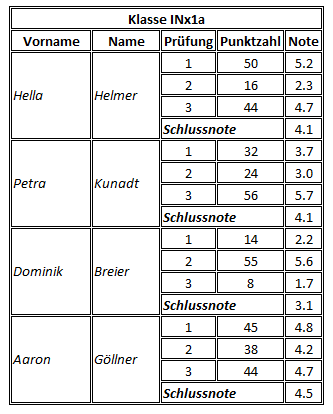

# Tabellen

## Aufgabenstellung

### Einstiegsübung

Ergänzen Sie Ihre Vorstellungsseite von vorhin mit einer Tabelle, in der Sie sinnvolle Inhalte einpflegen.
Versuchen Sie in Ihrer Tabelle auch Überschriftszeilen zu erstellen.

### Vertiefung

Versuchen Sie untenstehende Beispieltabelle in HTML aufzubauen. Recherchieren Sie, wie Sie in HTML mehrere Zellen zu einer verbinden können.

> **Tip:** Um den Rahmen darstellen zu lassen, verwenden Sie einfach das Attribut border des table-Tags und setzten dieses auf den Wert 1.
